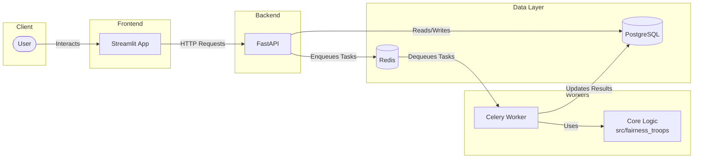
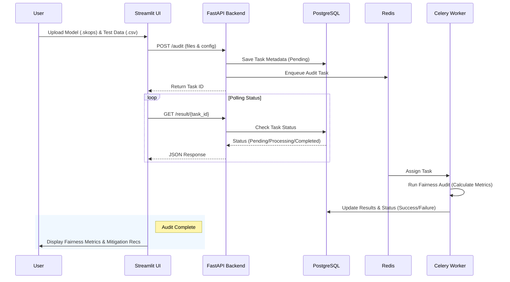

# 🚀 Bias & Fairness Debugger

A plug-and-play Python toolkit and Streamlit dashboard to audit trained ML models for hidden biases and suggest mitigation strategies.  
Check it out here! https://fairness-troops.streamlit.app/

Demo - https://youtu.be/jSK7wNZQzkc

---

## 🏗️ System Architecture

The application is built using a microservices architecture to ensure scalability and separation of concerns.



### Components
- **Frontend**: A Streamlit application (`app/`) that provides an interactive UI for users to upload models/data and view results.
- **Backend API**: A FastAPI service (`api/`) that handles requests, manages file uploads, and coordinates auditing tasks.
- **Worker**: A Celery worker that executes the compute-intensive fairness audits asynchronously using Redis as a message broker.
- **Database**: PostgreSQL for storing audit logs, task states, and results.
- **Cache/Broker**: Redis used as a task queue and for caching.

---

## 🔄 Data Flow

The following diagram illustrates the flow of data during a fairness audit session:



---

## 🎯 Features

* **Audit Metrics**: 
    * **Disparate Impact Ratio (DI)**: Measures ratio of favorable outcomes.
    * **Equal Opportunity Difference (EOD)**: Measures difference in True Positive Rates.
    * **Statistical Parity Difference**: Difference in positive outcome rates.
* **Executive-Ready Visuals**:
    * **Outcome Plots**: Visualize disparities in favorable outcomes.
    * **TPR/FPR Charts**: Compare true/false positive rates across groups.
    * **Explainability**: Permutation Feature Importance & Partial Dependence Plots (PDP).
* **Actionable Mitigation**: Suggests pre-processing strategies (e.g., Reweighting) and provides a downloadable CSV with sample weights.
* **Plug-and-Play**: Optimized for `scikit-learn` compatible models saved with `skops`.

---

## 🛠️ Tech Stack

* **Backend**: `FastAPI`, `Uvicorn`, `Pydantic`, `SQLAlchemy`
* **Frontend**: `Streamlit`
* **Task Queue**: `Celery` + `Redis`
* **Database**: `PostgreSQL`
* **Data Science**: `pandas`, `scikit-learn`, `matplotlib`, `seaborn`, `skops`
* **Infrastructure**: `Docker`, `Docker Compose`
* **Testing**: `pytest`

---

## 🚀 How to Run

### Option 1: Docker (Recommended)

Run the entire stack with a single command.

**Prerequisites:** [Docker Desktop](https://www.docker.com/products/docker-desktop)

1. **Build and Run:**
   ```bash
   docker compose up --build
   ```

2. **Access the Application:**
   * **Dashboard**: [http://localhost:8501](http://localhost:8501)
   * **API Docs**: [http://localhost:8000/docs](http://localhost:8000/docs)

3. **Stop the Application:**
   Press `Ctrl+C` or run `docker compose down`.

### Option 2: Local Development

If you want to run services individually without Docker.

**1. Setup Environment**
```bash
# Windows
python -m venv venv
.\venv\Scripts\activate

# macOS/Linux
python3 -m venv venv
source venv/bin/activate

# Install dependencies
pip install -r requirements.txt
pip install -e .
```

**2. Start Services**
You will need running instances of PostgreSQL and Redis. Configure `.env` with their URLs.

* **Start Backend**: `uvicorn api.main:app --reload`
* **Start Celery Worker**: `celery -A api.celery_service worker --loglevel=info`
* **Start Frontend**: `streamlit run app/app.py`

---

## 📂 Project Structure

```
fairness_troops/
├── api/                   # Backend API (FastAPI)
│   ├── main.py            # API Entrypoint
│   ├── tasks.py           # Celery Task Definitions
│   ├── schemas.py         # Pydantic Schemas
│   ├── models.py          # Database Models
│   ├── database.py        # DB Connection & Session
│   ├── cache.py           # Redis Cache Logic
│   └── celery_service.py  # Celery Worker Entrypoint
├── app/                   # Frontend App (Streamlit)
│   └── app.py             # Dashboard Entrypoint
├── test_validation.py     # Validation Script
├── src/
│   └── fairness_troops/   # Core Python Package
│       ├── core.py        # Main Auditor Class
│       ├── metrics.py     # Fairness Metrics Calculation
│       ├── mitigation.py  # Bias Mitigation Logic
│       ├── visuals.py     # Visualization Functions
│       ├── explainability.py # Feature Importance & PDP
│       └── reporting.py   # PDF Report Generation
├── data/                  # Data Storage (mounted volume)
├── examples/              # Example Scripts & Data
├── tests/                 # Unit Tests
├── docker-compose.yml     # Container Orchestration
├── Dockerfile             # Container Definition
└── pyproject.toml         # Dependencies & Config
```

---

## 🔍 Future Scope & Improvements

### Mitigation & Algorithms
- [ ] **Advanced Mitigation Techniques** — Implement in-processing (e.g., Adversarial Debiasing, Prejudice Remover) and post-processing (e.g., Calibrated Equalized Odds, Reject Option Classification) methods
- [ ] **Multi-Attribute Fairness** — Support auditing across intersectional groups (e.g., race × gender)
- [ ] **Fairness-Aware Model Selection** — Auto-select models that balance accuracy and fairness

### Monitoring & Observability
- [ ] **Prometheus Metrics** — Expose fairness metrics as Prometheus endpoints for real-time monitoring
- [ ] **Grafana Dashboards** — Pre-built dashboards to visualize fairness drift and model performance over time
- [ ] **Alerting System** — Configurable alerts when fairness metrics breach thresholds

### Cloud & Deployment
- [ ] **AWS Deployment Guide** — Step-by-step deployment using AWS ECS/EKS, RDS, and ElastiCache
- [ ] **Kubernetes Helm Charts** — Production-ready K8s deployment configurations

### AI-Powered Insights
- [ ] **Agentic AI Analysis** — LLM-powered natural language explanations of bias findings and recommendations
- [ ] **Automated Root Cause Analysis** — AI-driven identification of bias sources in training data
- [ ] **Smart Mitigation Suggestions** — Context-aware recommendations based on domain and data characteristics

### Platform Features
- [ ] **On-Platform Retraining** — Retrain models with mitigation strategies directly in the UI
- [ ] **Model Versioning** — Track and compare fairness metrics across model versions
- [ ] **Audit History & Reports** — Persist audit results with historical comparisons
- [ ] **Team Collaboration** — Multi-user support with role-based access control
- [ ] **API Rate Limiting & Auth** — Production-ready API security features

---

## 🤝 Contributing

Contributions are welcome!
1. Fork the repo and create a new branch (`git checkout -b feature/amazing-feature`).
2. Commit your changes (`git commit -m 'Add amazing feature'`).
3. Push to the branch (`git push origin feature/amazing-feature`).
4. Open a Pull Request.

---

## ⚖️ License

This project is licensed under the **MIT License**.
